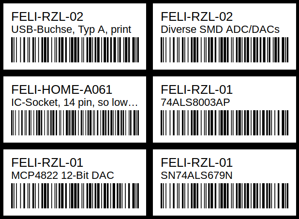

## partkeepr-label-gen

This tool generates a page with labels and barcodes from PartKeepr CSV export.
It is meant to be used in an environment where each part has its own storage 
location.

Usage:

1. Clone and run `npm install`
1. Install <a href="https://github.com/zint/zint">zint</a>
1. Open PartKeepr parts view
1. Click “Custom Export”. Add columns `name` and `storageLocation.name`. Save exported data.
1. Feed the resulting csv to the script:
    
    ```
    ./index.js -i input.csv -o output_folder_name
    ```
    
1. Open `output_folder_name/index.html` and print it.
1. Optionally, edit `template/page.html` to adjust the layout

Here is how it looks (parts from PartKeepr demo):


